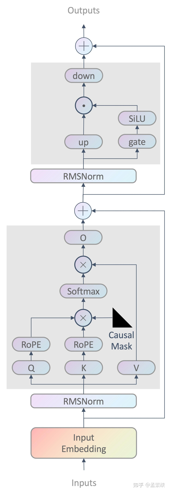

# Atten layer 实现

说明：本仓库中均使用的是 `[in_dims, out_dims]`而不是 pytorch常用的`[out_dims, in_dims]` 的维度顺序。

llama结构图：

# LLaMA 模型各主要层级在 GGUF 文件中的维度说明
| 层级 | 名称 / 权重矩阵 | 维度 | 说明 | 示例（LLaMA 3.1） |
|------|----------------|------|------|------------------|
| **词嵌入层** (Embedding Layer) | `embedding.weight` | `[vocab_size, embedding_dim]` | 将 token ID 映射到高维向量表示 | vocab_size = 128,256 embedding_dim = 4,096 |
| **注意力层** (Attention Layer) | `attention.query.weight` (Q) | `[embedding_dim, num_heads * head_dim]` | 查询矩阵 | |
| | `attention.key.weight` (K) | `[embedding_dim, num_heads * head_dim]` | 键矩阵 | |
| | `attention.value.weight` (V) | `[embedding_dim, num_heads * head_dim]` | 值矩阵 | |
| | `attention.output.weight` (O) | `[num_heads * head_dim, embedding_dim]` | 输出矩阵 | |
| **前馈网络层** (Feed-Forward Network, FFN) | `mlp.down_proj.weight` | `[ffn_dim, embedding_dim]` | 下投影矩阵 | |
| | `mlp.gate_proj.weight` | `[embedding_dim, ffn_dim]` | 门控矩阵 | |
| | `mlp.up_proj.weight` | `[embedding_dim, ffn_dim]` | 上投影矩阵 | |
| **输出层** (Output Layer / lm_head) | `lm_head.weight` | `[vocab_size, embedding_dim]` | 将模型输出映射回词汇表空间 | vocab_size = 128,256 embedding_dim = 4,096 |
| **位置编码** (Positional Encoding) | `rotary_emb.inv_freq` | `[num_heads]` | 用于旋转位置编码 (RoPE)，提供位置信息 | |